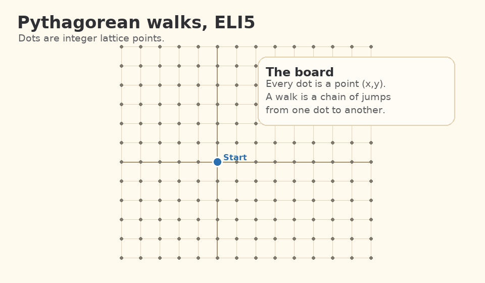

# Pythagorean Walks Research Workspace

This workspace studies the Pythagorean-walk graph on $\mathbb{Z}^2$ from Jan
Willemson's paper `Pythagorean walks on Z^2`
(`arXiv:2605.20831v1`, 20 May 2026).

The graph has an edge for a displacement $(dx,dy)$ exactly when both coordinate
changes are nonzero and $dx^2+dy^2$ is a square.

The paper proves that the graph has diameter 3, proves the known
distance 3 representatives $(1,0)$, $(2,0)$, and $(2,1)$, gives one infinite
family of two-step certificates, and conjectures that these representatives and
their sign/swap images are the only distance 3 vertices.

## ELI5 Visualization



The animation shows the core idea: dots are lattice points, allowed jumps are
non-horizontal/non-vertical Pythagorean jumps, some nearby points still need
detours, and the known distance 3 candidates are tiny points near the origin.

## Status

The full conjecture is still open in this workspace: the project has not proved
that every non-axis non-exception target has a two-step certificate.

The project has, however, proved and encoded several results beyond the
original paper:

- The horizontal-axis slice is complete. For every integer $n\ge3$,
  $d((0,0),(n,0))\le2$.
- By sign changes and coordinate swap, every axis target is now classified:
  only $(\pm1,0)$, $(\pm2,0)$, $(0,\pm1)$, and $(0,\pm2)$ remain in the known
  distance 3 orbit.
- The paper's diameter-three spanning construction is executable for every
  target, and the paper's obstruction arguments for $(1,0)$, $(2,0)$, and
  $(2,1)$ are tracked as symbolic guardrails.
- Many exact infinite two-step families are recorded, including lattice,
  Gaussian-transform, Euclid-strip, parallel-divisor, signed-Theorem-3, and
  exceptional-ray families.
- Exact finite audits certify every non-exception target in the signed box
  $|g|,|h|\le500$, every non-exception unit-coordinate target with
  $|n|\le500$, and every multiplier $2\le n\le500$ on the ray $(2n,n)$.

## Main New Proof

The horizontal-axis theorem is the main complete theorem added here:

$$
\text{For every integer } n\ge3,\qquad d((0,0),(n,0))\le2.
$$

The proof splits into the following cases:

- Odd $n\ge3$ use a consecutive-parameter Euclid construction.
- Even $n\ge6$ use the midpoint construction, since every integer $a\ge3$ is a
  leg of an integer right triangle.
- The remaining even target $n=4$ uses the explicit midpoint $(-5,12)$.

This resolves the axis part of the paper's conjecture. The paper already proves
that $(1,0)$ and $(2,0)$ have distance $3$; the theorem above proves every later
horizontal point has a two-step path, and symmetry gives the vertical axis.

See `notes/pythagorean-walks-axis-subproblem.md` for the written proof and
`horizontal_axis_proof_certificate` for the executable certificate constructor.

## Exact Families Beyond The Paper

The non-axis proof notebook records several theorem-level families. These are
algebraic certificate constructors, not bounded searches:

- Certificate transport under sign changes and coordinate swap.
- Scaling of any two-step certificate by a nonzero integer.
- Square-norm Gaussian transformations and a target-facing Gaussian divisor
  criterion.
- A two-edge lattice criterion, with prime-determinant residue-line families.
- Determinant-$7$, determinant-$13$, determinant-$17$, and additional
  small-prime congruence families modulo $23$, $31$, $37$, $41$, $43$, $47$,
  $53$, $67$, $73$, $83$, $89$, $107$, $109$, $149$, $157$, $173$, $179$,
  $191$, $193$, $211$, $239$, $241$, $251$, and $269$.
- An orthogonal lattice family from every positive Pythagorean triple.
- A consecutive-leg swap-lattice family covering $g+h\equiv0$ and
  $g-h\equiv0$ modulo each Pell-generated sum of consecutive Pythagorean legs.
- A parallel-direction divisor reduction: for fixed first-step direction $U$,
  the condition $|T-rU|^2=\square$ factors through divisors of
  $\det(U,T)^2$.
- General Euclid strip, half-leg strip, unit-coordinate strip, and affine
  consecutive-hypotenuse strip families, with target-facing recognizers.
- A signed form of the paper's Theorem 3, a divisor-strengthened version
  replacing the paper's constant $1$ by any nonzero divisor of $gh$, and a
  ray-facing multiplier-modulus form.
- A quadratic-strip corollary of Theorem 3 covering the sign/swap orbit of
  $(2hn^2-1,h)$ and $(g,2gn^2+1)$ for nonzero fixed coordinate.

## Exceptional Ray Progress

The primitive target $(2,1)$ remains a known distance 3 obstruction, but many
nontrivial multiples on its ray are now proved to have distance at most $2$:

- All even positive multipliers.
- All positive multipliers $n\equiv3\pmod4$.
- All positive multipliers $n\equiv5,17\pmod {20}$.
- A mod-$20$ skeleton covering every positive multiplier class except $1$ and
  $9$.
- A mod-$260$ refinement from the fixed $u=5$ strip.
- Parallel-divisor families covering multipliers with a divisor $3$ or $7$
  modulo $10$; $3$, $7$, $19$, or $23$ modulo $26$; $7$, $13$, $21$, or $27$
  modulo $34$; or $7$, $25$, $33$, or $51$ modulo $58$.
- Scaling families from exact base rows $n=3,29,41,53,61,73$.
- A finite exact audit for every multiplier $2\le n\le500$ on $(2n,n)$.
- Divisor-lift closure now scales any certified proper divisor on the
  exceptional ray; with the current seed families, the unresolved multipliers
  below $2000$ are all prime.

## Finite Audits

The finite audits are exact statements: each residual row is an explicit
midpoint identity, and every returned certificate is checked directly.

Current finite coverage:

- Every non-exception target with $|g|,|h|\le500$.
- Every non-exception target in the sign/swap orbit of $(n,1)$ with
  $|n|\le500$.
- Every multiplier $2\le n\le500$ on the exceptional ray $(2n,n)$.

These audits are not extrapolated to a theorem outside the stated finite
ranges.

## Layout

- `papers/pythagorean-walks-on-z2.md`  
  Markdown notes/transcription from Jan Willemson's paper.

- `notes/pythagorean-walks-axis-subproblem.md`  
  Main proof notebook for the horizontal-axis subproblem.

- `notes/pythagorean-walks-full-conjecture-progress.md`
  Current non-axis proof notebook: symmetry reduction, diameter-three upper
  bound, lattice families, Euclid strip templates, signed Theorem 3
  certificates, and remaining gap.

- `notes/verification-changelog.md`  
  Audit trail for corrected hypotheses, promoted lemmas, and executable
  guardrails.

- `experiments/pythagorean_walks.py`  
  Reusable predicates, certificate validators, bounded searches, and
  parametrized certificate generators.

- `experiments/render_eli5_gif.py`
  Reproducible renderer for the README animation.

- `tests/test_pythagorean_walks.py`  
  Verification suite for graph predicates, paper examples, known exceptions,
  explicit certificates, formula families, and bounded coverage audits.

- `assets/pythagorean-walks-eli5.gif`
  ELI5 animation for the problem statement.

- `data/horizontal_axis_certificates.json`  
  Reusable two-step certificates for $3\le n\le20$ and known horizontal-axis
  exceptions.

- `data/shared_leg_residue_coverage.md`  
  Bounded residue witness table for the quadratic family and shared-leg
  generator.

## Verification

Run:

```bash
python3 -m unittest discover -s tests -v
```

Current expected result:

```text
Ran 125 tests
OK
```

## Evidence Discipline

Bounded searches are treated as falsification tools, not proofs. A result such
as `not_found_within_bound` means only that the current search box found no
certificate. Exact algebraic lemmas are recorded separately in the proof notes
and backed by formula tests where possible.
